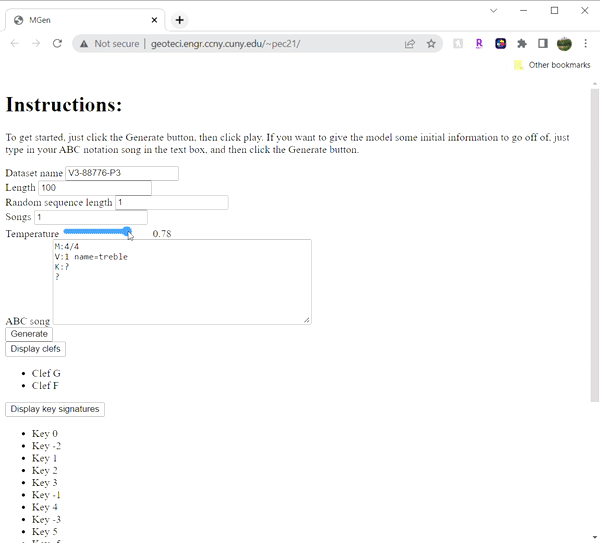

# Music Generator 
## _Creating new music with Transformer model_

[](https://github.com/Matthew1172/MusicGenerator/tree/TransformerGeneratorMusic21)

MusicGen is a music generator using Transformer deep learning model to learn existing patterns and generate music similar to it. 

The deep-learning Music generator is based on tutorial as a part of "Introduction to Deep Learning 2021" offered from MIT 6.S191 [GoodBoyChan](https://goodboychan.github.io/python/tensorflow/mit/2021/02/14/music-generation.html). This project was  for [Professor J. Zhang's](https://www.ccny.cuny.edu/profiles/jianting-zhang) Senior Design course at [The City College of New York (CCNY)](https://www.ccny.cuny.edu/engineering) for the Spring '22 semester.


## Features
- Choose the type of music you want generated!
- Get a new melody every time
- Play songs with a vast selection of instruments
- ✨Magic ✨


## Table of Contents
- [Contributors](#contributors)
- [Introduction](#introduction)
- [Targeted Application](#targeted-application)
- [Architecture/Framework](#architectureframework)
- [Process to train the Transformer model](#process-to-train-model)
- [Generate music](#generate-music)
- [Sources](#sources)

## Contributors 
[Bhumika Bajracharya](https://github.com/mika-shree), [Liana Hassan](https://github.com/lianahasan), [Gene Lam](https://github.com/genelam26), [Matthew Pecko](https://github.com/Matthew1172), [Daniel Rosenthal](https://github.com/danrose499) 

## Introduction
Music composition has long been a part of the video game experience with game developers spending as much as 15% of their production budget on custom soundtracks (Sweet). Game directors want tailored music that will immerse the player in virtual worlds and enhance their gameplay. We are proposing the development of a music generator that uses the transformer machine learning model to create new music. Previous attempts from our group have used 1. An Optical Music Recognition (OMR) System to classify notes on prepared sheet music 2. Long short-term memory (LSTM) model to generate new sheet music based on output from the OMR system. After obtaining low accuracy on the OMR system, we plan to pivot our project and develop the transformer model, which would generate new music based on prepared sheet music directly. As the need for personalized user experience grows in the gaming industry with investments in the metaverse, we are developing a music generator for the next generation of games. 

## Targeted Application
Why a music generator? As it stands, most video games have soundtracks that play as you progress through the game. After spending enough time playing, however, one starts to notice that there are a limited amount of songs that play cyclically, making the game feel limited and repetitive. Imagine, for contrast, a video game that plays a new song every time you play where each song is still thematically linked. Using our music generator, we can feed the model with songs written for a specific game and have the generator create a new song every time you play with a similar feel to the overall soundtrack. Moreover, many games currently have discrete songs for different situations. You can have peaceful music playing as you travel through the world only to have the song suddenly stop for more aggressive music to start playing as you start to fight a boss. Our music generator could be extended to allow game signals to tell the generator to make the song change its theme without stopping it. This will give the game a much greater sense of continuity as the song can change along with your progress instead of having to stop for a new one to start.

Obviously, this is only one application of a music generator, but it is one that demonstrates the creative impacts that it can have. But this project has uses in many different scenarios, such as artists, creators, composers, and producers who are looking for a creative spark when starting a new project. 

Finally, there also exist commercial applications of the music generator. We believe that this model has the potential to unlock new trends in the music industry as it can learn from similar aspects used in popular songs that humans may not be aware of. Additionally, many users of services like Spotify have expressed how impressed they were that those services were able to use machine learning to predict which songs they will like and add them to their mixes. With a music generator, we believe that these music services will be able to use their data on listeners’ favorite songs to create entirely new songs that they should enjoy instead of recommending them songs that already exist. 

## Architecture/ Framework

MusicGen uses a number of open source projects to work properly:
- Jupyter Notebook
- Music21
- [GoodBoyChan](https://goodboychan.github.io/python/tensorflow/mit/2021/02/14/music-generation.html) music generation tutorial
- pytorch

###Transformer Model
Transformer model is a deep learning model that utilises self-learning 

## Process to Train the Transformer Model

1. Install anaconda.
2. Ensure that all dependencies have been installed. To install packages such as Music21, regex, torch, etc. type the following in the command line:
```
conda install torch
conda install Music21
conda install regex
conda install tqdm
```
2. Parse the dataset before training the model.

## Generate music (website)
The [website](http://geoteci.engr.ccny.cuny.edu/~pec21/) implements the music generator model. New music can be generated without any changes to the defaults given. If desired, to generate music with some initial music information to base off of, the key, clef, and so on can be added. 




## License
MIT